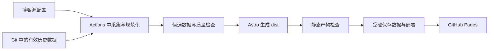

# BaiyunUBlogroll 重构调研：保留 GitHub Pages

调研日期：2026-09-14。本文区分已核实的平台事实与待确认的设计建议。当前仅形成方案，没有更改应用、工作流、仓库设置或线上部署，也没有请求真实订阅源。

## 推荐结论

建议采用 **Astro + TypeScript，使用 Node.js 完成构建期 RSS/Atom 采集，继续通过 GitHub Actions 部署到 GitHub Pages**。重新设计数据模型、采集流程、页面结构和发布流程，不逐函数翻译旧 Python 实现。

判断依据是用户明确允许替换 Python、希望全面重构早期实现；网站的核心仍是博客目录与文章聚合，适合预生成页面。选择 Astro 是本项目的工程判断，不是 GitHub Pages 的要求。

| 路线 | 适合本项目的地方 | 代价与判断 |
| --- | --- | --- |
| Astro + TypeScript（推荐） | 页面、样式、交互和采集使用同一套 Node 工具链；页面组件、内容集合适合博客目录与文章列表 | 需要迁移 Python 采集逻辑，但当前没有必须保留的 Python 独有运行需求；适合这次整体重构 |
| Eleventy + Node.js | 同样可以生成静态站并部署 Pages，适合偏模板和文档的站点 | 若主要目标只是简洁列表，足够使用；本次希望同时整理页面组件和类型约束，优先选择 Astro |
| Python + Jinja 模板 | 改动成本较小，可以继续静态发布 | 适合以保留旧工具链为目标的修整；在本次不要求保留 Python 的前提下，不作为首选 |

Astro 官方提供 GitHub Pages 部署方案；Astro 组件可输出静态 HTML，交互按需加入；内容集合可以从本地 JSON 加载并校验数据。[Astro 部署](https://docs.astro.build/en/guides/deploy/github/)、[Astro 组件与交互](https://docs.astro.build/en/concepts/islands/)、[内容集合](https://docs.astro.build/en/guides/content-collections/)。Eleventy 也有 Pages 部署说明。[Eleventy 部署](https://www.11ty.dev/docs/deployment/)。Jinja 可用于从模板生成文档，并显式启用 HTML 自动转义。[Jinja API](https://jinja.palletsprojects.com/en/stable/api/)。

建议的数据流：



读者访问时只需要 HTML、CSS、少量 JavaScript 和静态 JSON。RSS 抓取、解析库及凭据都留在 Actions 构建侧。

## 当前仓库证据

以下是本地工作区现状，不代表线上最新数据；既有未提交修改也是本轮调研基线的一部分。

| 发现 | 证据 | 重构应解决的问题 |
| --- | --- | --- |
| 4 个订阅源写在脚本内，抓取、转换、页面拼接集中在一个文件 | [main.py](D:/MyGithubProject/BaiyunUBlogroll/main.py:18) | 配置可独立维护，采集和页面渲染分离 |
| 同一个源重复抓取，Requests 请求未指定超时，异常会中断主流程 | [main.py](D:/MyGithubProject/BaiyunUBlogroll/main.py:158) | 每源独立处理、有限超时与重试，统一使用一次响应完成解析 |
| 当前 JSON 有 107 条文章、4 位作者、0 个重复 URL；62 条无更新时间、15 条两个日期均空 | [config.json](D:/MyGithubProject/BaiyunUBlogroll/config.json:1) | 空日期必须是合法业务状态，不能因此丢文章 |
| 发表时间包含 45 个纯日期、47 个 RFC 日期、15 个空值；排序仅使用 updated 字符串 | [main.py](D:/MyGithubProject/BaiyunUBlogroll/main.py:193) | 重新定义日期解析、展示和排序规则 |
| test.py 是另一份会联网写文件的脚本，无测试断言 | [test.py](D:/MyGithubProject/BaiyunUBlogroll/test.py:195) | 使用固定输入和可断言输出建立真正的回归测试 |
| Workflow 先 git add . 写回 master，再发布整个仓库根目录 | [main.yml](D:/MyGithubProject/BaiyunUBlogroll/.github/workflows/main.yml:39) | 限定数据写入白名单，仅部署构建产物 |
| 两个字体文件共约 34.9 MiB；词云入口禁用，当前页面未引用词云 | [main.py](D:/MyGithubProject/BaiyunUBlogroll/main.py:43) | 建议首版不启用词云，发布包不包含其字体与生成依赖；这不代表网页当前会下载这些字体 |
| README 把文章 JSON 写成源配置，并描述与主脚本不符的转换流程 | [readme.md](D:/MyGithubProject/BaiyunUBlogroll/readme.md:7) | 更新运行、配置、贡献与发布说明，使文档匹配实现 |

## GitHub Pages 的能力边界（官方事实）

| 事项 | 已核实结论 | 对本项目的意义 |
| --- | --- | --- |
| 托管形态 | Pages 发布静态 HTML、CSS、JavaScript，可在发布前构建；不提供 Python 等服务端运行时。[Pages 简介](https://docs.github.com/en/pages/getting-started-with-github-pages/what-is-github-pages)、[创建站点](https://docs.github.com/en/pages/getting-started-with-github-pages/creating-a-github-pages-site) | 抓取和生成发生在 Actions；读者访问预生成页面及静态 JSON。不能依赖线上常驻 API。 |
| 构建语言 | Actions 官方支持配置 Python、Node.js 并执行安装、构建和测试命令。[Python 工作流](https://docs.github.com/en/actions/tutorials/build-and-test-code/python)、[Node.js 工作流](https://docs.github.com/en/actions/tutorials/build-and-test-code/nodejs) | 保留 Pages 不等于必须保留 Python，也不限定 Jekyll；可选择适合重构的构建技术。 |
| 发布方式 | 自定义 Actions 可使用 `configure-pages`、`upload-pages-artifact`、`deploy-pages`；部署 job 至少需要 `pages: write`、`id-token: write`，关联构建 job 与 `github-pages` environment。[自定义工作流](https://docs.github.com/en/pages/getting-started-with-github-pages/using-custom-workflows-with-github-pages) | 建议在同一工作流完成抓取、校验、构建、上传、部署。 |
| 发布目录 | `upload-pages-artifact` 的 `path` 指定静态输出目录，默认 `_site/`；artifact 顶层需要站点入口文件。[上传 action](https://github.com/actions/upload-pages-artifact)、[创建站点](https://docs.github.com/en/pages/getting-started-with-github-pages/creating-a-github-pages-site) | 可明确发布 `dist/`，无需把整个仓库或生成 HTML 提交给默认分支。 |
| 项目路径 | 默认项目站点位于 `https://<owner>.github.io/<repositoryname>/`，自定义域名是另一种地址配置。[Pages 简介](https://docs.github.com/en/pages/getting-started-with-github-pages/what-is-github-pages) | 构建时统一处理 base path；资源、JSON、分页链接都必须能在 `/BaiyunUBlogroll/` 子路径工作。实际线上设置实施前再核实。 |

使用分支直接发布时，来源目录仅可选分支根目录或 `/docs`；自定义 Actions 不受这两个目录名限制。GitHub 对非 Jekyll 构建或不希望专设编译产物分支的情况推荐 Actions。[发布来源配置](https://docs.github.com/en/pages/getting-started-with-github-pages/configuring-a-publishing-source-for-your-github-pages-site)

## 定时抓取的运行约束（官方事实）

定时工作流必须存在于默认分支，并在默认分支最新提交上运行。整点等高负载时期可能延迟，严重时排队任务可能被丢弃；公开仓库连续 60 天没有仓库活动时会自动停用定时工作流。默认时区为 UTC，当前官方文档也支持可选 IANA `timezone`。以上来自 [schedule 事件说明](https://docs.github.com/en/actions/reference/workflows-and-actions/events-that-trigger-workflows#schedule)。

设计建议：首版沿用目前每天一次的节奏并保留手动入口；若后续明确需要更快更新，再提高频率并错开整点。界面显示实际检查时间，不承诺精确到点更新。维护说明应包含定时任务停用后的重新启用步骤，不用空提交假装有业务变化。若要求长期完全无人维护且严格准时，需要先重新评估这一目标与纯 GitHub 平台约束能否同时成立。

## 旧数据不能只存 cache 或 artifact（官方事实）

- Actions cache 默认在超过 7 天未访问后删除，也会受容量限制淘汰；保留与容量配置可以调整，但仍有淘汰机制。[缓存限制与淘汰](https://docs.github.com/en/actions/reference/workflows-and-actions/dependency-caching#usage-limits-and-eviction-policy)
- 通用 workflow artifacts 默认保留 90 天，可配置保留期；公开仓库通常为 1–90 天范围。[仓库 Actions 设置](https://docs.github.com/en/repositories/managing-your-repositorys-settings-and-features/enabling-features-for-your-repository/managing-github-actions-settings-for-a-repository#configuring-the-retention-period-for-github-actions-artifacts-and-logs-in-your-repository)
- Pages 专用 `upload-pages-artifact` 的 `retention-days` 默认只有 **1 天**，不要与通用默认值混用。[上传 action 的输入参数](https://github.com/actions/upload-pages-artifact#inputs-)

据此建议：cache 用于加速依赖安装；artifact 用于构建传递和有限期诊断。两者都不作为失败恢复时唯一的内容快照。

## 不增加外部服务的旧数据方案（设计建议）

优先考虑在默认分支 `data/` 按订阅源保存结构化的有效 JSON 数据，内容包括稳定文章标识、标题、原文链接、纯文本摘要、日期及来源标识。当前 107 条记录先作为迁移基线保留。建议采用“保留已收录文章，按标识更新”的方式，避免源只返回近期内容时丢掉旧文章；保留上限、人工撤回及来源移除规则还需逐项对齐。这里不承诺抓取源未提供的完整历史，也不额外下载全文或图片。

| 方案 | 优点 | 代价 | 推荐条件 |
| --- | --- | --- | --- |
| 默认分支 `data/` | 单次 checkout 即有可用旧数据；本地可离线生成；代码与数据结构一起演进 | 默认分支增加真实数据变更提交；自动写入须符合分支规则 | 当前小体量项目的首选，前提是允许受控自动更新数据 |
| 独立数据分支 | 数据提交与源码历史分离 | 增加分支初始化、两次 checkout、版本兼容和并发更新处理 | 默认分支禁止自动写入，或数据提交规模已影响维护时采用 |

建议约束如下：

1. 每次先读取旧快照，再逐源抓取、校验、规范化和去重。源失败时保留该源旧条目；单条异常不应清空整个源。
2. 正常源更新，失败源沿用旧快照，并在生成页面和 Actions 摘要中标记降级。缺少发布时间的文章不要直接当作今天的新文章。
3. 所有源均失败或构建校验失败时，本轮不部署、不覆盖快照。首次初始化无快照又抓取失败时，明确失败，不发布空站。
4. 数据、HTML、链接路径检查通过后，才持久化候选快照与发布同一份构建结果。快照代表“最近验证通过的数据”；它不等同于“最近成功部署”。发布失败应留有明确状态供重试。
5. 只在规范化后的业务内容发生变化时提交，提交路径严格限制为预先配置的 `data/` JSON 白名单。不要使用 `git add .`，不要提交生成 HTML、生成 Markdown、临时文件或每轮变化的时间戳。
6. “本轮检查成功但内容未变”的时间写入本轮发布的静态状态 JSON 和运行摘要，避免单纯更新时间导致每轮 Git 提交。持久快照时间明确命名为快照保存时间，不能误标成最近检查时间。
7. 将整个读取、更新、持久化、发布流程串行控制，并在推送前检查默认分支是否前进；冲突时放弃本轮写入或从新基线重建，不能强推覆盖其他变更。

这些是本项目的设计选择，并非 GitHub 提供的数据库或事务保证。实际分支保护、token 权限和并发行为，需要实施阶段验证。

权限应按 job 限定：构建测试用只读权限；仅持久化快照的 job 申请 `contents: write`；部署 job 申请 Pages 所需权限。文件白名单是脚本约束，不是 `contents: write` 本身的路径权限。[工作流权限说明](https://docs.github.com/en/actions/reference/workflows-and-actions/workflow-syntax#permissions)

使用 `GITHUB_TOKEN` 推送提交不会再触发新的 `push` 工作流。因此数据提交后的部署应在当前工作流中显式继续，而不是等待自动触发下一轮构建。[工作流触发规则](https://docs.github.com/en/actions/how-tos/write-workflows/choose-when-workflows-run/trigger-a-workflow#triggering-a-workflow-from-a-workflow)

## 建议怎样重新组织项目

下面是职责示意，不是已创建的工程目录。

```text
config/sources.json       人工维护博客名、主页、Feed URL、稳定来源 ID、启用状态
scripts/update-feeds.ts   采集命令入口，汇总结果与退出状态
src/lib/feeds/            请求、解析、规范化、合并的实现
src/content.config.ts    页面读取有效文章数据的集合定义
src/pages/               首页、博客目录、加入说明等静态页面
src/components/          文章卡片、博客卡片、筛选栏等页面组件
src/styles/              颜色、间距、排版与响应式样式
data/                    受控保存的文章数据和来源信息
public/                  确实需要公开的静态资产
tests/fixtures/          RSS、Atom、错误输入及迁移样本
dist/                    构建输出，作为唯一发布目录，不提交源码分支
```

采集模块的调用方只需传入源配置和旧数据，获得规范化文章、逐源结果和问题清单。网络请求是可替换的测试接入点；纯解析、日期处理、合并不应自动联网或写文件。渲染只读取已校验数据，保证日常改页面与离线构建不必等待真实博客响应。规模较小，不预先搭通用插件平台或大量转发层。

RSS/Atom 解析首选评估 `rss-parser`：它提供字符串解析、常见字段映射和 TypeScript 类型，支持自定义字段。网络下载由本项目统一控制，再把响应交给解析器；Node 提供 fetch 与 AbortSignal 超时控制。[rss-parser 官方仓库](https://github.com/rbren/rss-parser)、[Node 全局 API](https://nodejs.org/api/globals.html)。必须用现有四种来源的固定 XML 样本检查标题、链接、摘要、作者与两类日期后再锁定依赖，不能把“库支持 Atom”当作本项目兼容性测试通过。

`feedsmith` 也是候选，提供 RSS、Atom、RDF、JSON Feed 及类型定义；只有上述样本证明首选存在不可接受的字段损失或解析问题时再换用。依赖采用实施时验证的稳定版并提交锁文件。[Feedsmith 官方仓库](https://github.com/macieklamberski/feedsmith)。

## 页面与数据规则建议

**首版页面**：首页展示最新文章，博客目录展示来源与主页，加入说明解释提交源配置的流程。首页包含标题、作者或所属博客、日期、短摘要、原文入口；加作者筛选、标题/摘要搜索、合理的分页或分批展示，并重做移动端排版。文章内容应在初始 HTML 中可读，JavaScript 用于增强交互。

当前文章 JSON 约 64.4 KiB，建议先由静态 JSON 支持浏览器端中文子串搜索和作者筛选；搜索全部收录条目，不局限当前分页。搜索范围是本地保存的标题、作者和摘要，不宣称原文全文搜索。空结果、清除筛选、显示条数与最终可见文章数应一致。

Pagefind 可作为后续站内多页面搜索的选项；它有中文分词支持，但默认按页面组织索引，同页多个正文区会合并。因此对“多篇外部文章卡片在一个聚合页”的当前形态，不能直接默认获得逐篇文章搜索结果。[Pagefind 中文支持](https://pagefind.app/docs/multilingual/)、[索引范围](https://pagefind.app/docs/indexing/)。

**日期**：保留发表、修改、未知三种真实状态。排序可优先使用有效更新时间、其次发表时间，两个都缺失的条目稳定置后。排序回退不应把发表时间显示成修改时间。RFC 时区统一比较；旧数据丢失的时区不能凭空补造，纯日期显示不能因时区换算偏移一天。缺失日期不使用抓取时间冒充。该排序会改变旧站展示顺序，需作为明确行为变更验收。

**内容**：摘要以纯文本渲染，模板保持默认转义；原文及来源链接限定 HTTP/HTTPS，前端搜索结果同样不能直接用外部字符串拼 HTML。来源显示名以人工配置兜底，避免把订阅 XML 页的 title 或请求错误字符串当成作者。文章标识建议结合来源 ID 与可靠的 GUID/规范化原文链接；不要随意删除查询参数造成不同文章误合并。

**失败与历史**：零条有效文章、异常空 Feed 需要显式处理，不能自动清空旧数据。文章从源中消失不等于作者要求撤回；已收录历史保留策略必须配套人工移除方式。界面区分文章更新、最近检查和数据降级状态。所有源失败时保持原部署并让本轮 Actions 明确失败；因为没有新部署，旧页面不会凭空出现本轮失败信息。

## 实施顺序与验收建议

1. **建立数据基线并重写采集模块**：以当前工作区为准保存迁移材料，覆盖 107 条文章、RSS/Atom、空字段、混合日期、重复记录、空源及失败恢复。新数据模型通过后替换旧生成链路。
2. **用 Astro 完成页面重构**：落实静态页面、组件、样式和搜索筛选；使用固定数据完成桌面与移动端验证。内容完整性、原文链接、键盘操作和子路径资源是验收重点。
3. **替换 Actions 发布链路并清理旧实现**：PR 只做无凭据的离线校验和构建；受信任分支执行刷新与正式部署。迁移核对通过后退役 Python 入口、重复脚本和不用的资产，重写 README。部署配置切换在方案确认后的实施阶段进行。

最少应证明：迁移不因日期缺失丢掉现有 107 条；失败源保留旧文章；所有源失败不发布空站；同一数据重复构建有稳定顺序；Git 保存数据与本次产物可关联；默认分支前进时不覆盖新提交；根路径和项目子路径两种构建的 CSS/JS/JSON/导航都正确；PR 无发布或自动回写权限。

这些是建议的检查项目，当前没有运行新实现或宣称测试通过。真实 Feed 可达性、解析库对四个源的兼容性、Pages 当前设置、分支保护与 token 权限仍未现场验证。

## 下一步对齐

先确认是否采用 **Astro + TypeScript 全面重构，GitHub Pages 保持为托管平台**。方向确认后再逐项确定页面呈现、历史保留和更新节奏，再形成实施设计；本调研不等于实现或部署获批。
