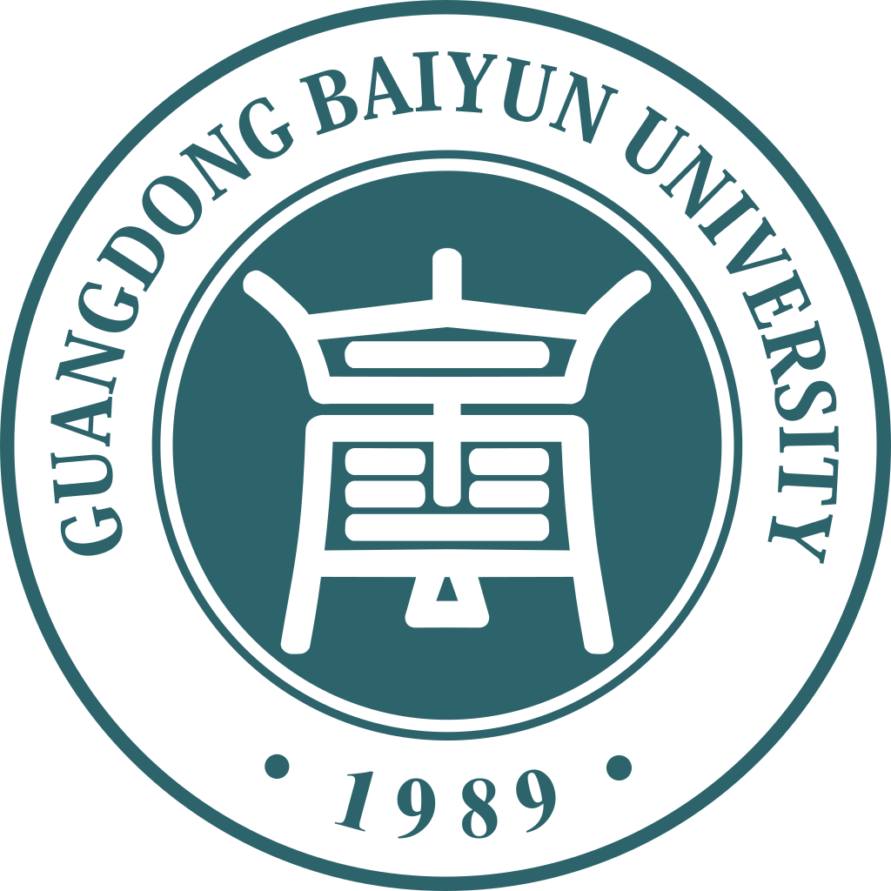

  

<h1 align="center">BaiyunU Blogroll</h1>

  
  
  

  <a href="https://baiyunu.nyc1.xyz/">访问站点</a> ·
  <a href="https://github.com/NgaiYeanCoi/BaiyunUBlogroll/issues/new/choose">申请加入</a> ·
  <a href="CONTRIBUTING.md">贡献指南</a> ·
  <a href="https://github.com/NgaiYeanCoi/BaiyunUBlogroll/issues">反馈问题</a>

## 项目介绍

BaiyunU Blogroll 是广东白云学院同学与校友的独立博客目录和文章聚合站，收集大家的技术分享、校园日常与独立思考，让更多白云学子的博客被看见。

项目通过 RSS / Atom 收录文章信息，展示标题、摘要与日期，并链接回原博客阅读。站点使用 Astro 生成静态页面，由 GitHub Actions 构建并发布到 GitHub Pages。

## 功能

- **博客目录**：查看博客名称、简介、头像、已收录文章数量与最近文章日期，直接访问原博客。
- **文章动态**：聚合不同博客的文章，提供日期展示、分页与原文入口。
- **搜索与筛选**：按博客筛选，搜索文章标题、摘要、作者和博客名称。
- **定时更新**：发布工作流每天北京时间 00:30 尝试刷新 RSS / Atom，也支持维护者手动触发。
- **内容撤回**：支持撤回整个来源或单篇文章，撤回规则同时作用于页面和公开搜索索引。

## 加入博客目录

欢迎广东白云学院同学与校友分享自己的独立博客。准备好以下信息，通过[加入申请](https://github.com/NgaiYeanCoi/BaiyunUBlogroll/issues/new/choose)提交，维护者会人工审核：

| 信息            | 说明                                                                           |
| --------------- | ------------------------------------------------------------------------------ |
| 博客 ID         | 唯一且长期稳定的标识，以英文字母或数字开头，只含英文字母、数字、下划线或连字符 |
| 博客名称        | 希望在目录中展示的名称                                                         |
| 博客主页        | 可以公开访问的完整 HTTP(S) 地址                                                |
| RSS / Atom 地址 | 可以公开访问、解析的订阅地址                                                   |
| 头像与简介      | 可选；头像使用完整 HTTP(S) 地址                                                |

熟悉 GitHub 的同学也可以通过 Pull Request 修改 `config/sources.json`，具体步骤见[贡献指南](CONTRIBUTING.md#添加或更新博客)。

## 更新资料与撤回内容

博客改名、更换域名或订阅地址时，可以提交 Issue 或 Pull Request 更新资料。已有博客的 ID 应保持不变，以保留文章与来源之间的关联。

如需撤回博客或文章，请在 [Issues](https://github.com/NgaiYeanCoi/BaiyunUBlogroll/issues) 中提供博客 ID、主页或文章链接，并说明希望撤回的范围。配置方法见[内容撤回说明](CONTRIBUTING.md#撤回来源或文章)。

## 参与贡献

欢迎补充博客资料、修复问题、改善页面体验与完善文档。请阅读 [CONTRIBUTING.md](CONTRIBUTING.md)，其中包含：

- 本地开发环境、运行命令与项目结构。
- 博客配置、RSS 刷新与内容撤回流程。
- 验证方式、Pull Request 提交与问题反馈要求。
- 维护者使用的 GitHub Pages 发布说明。

## 许可

项目代码采用 [MIT 许可证](LICENSE)。收录文章的版权及许可由原作者决定，请通过原文入口阅读并遵守原博客的使用要求。
